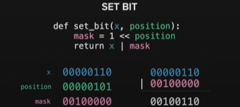
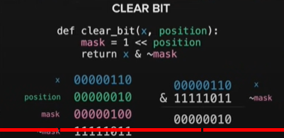

A signed number −x equals an unsigned number 2n − x.
For example, the following pseudo-code snippet shows that the signed number 
x = −43 equals the unsigned number y = 232 −43: 


If a number is larger than the upper bound of the bit representation, the number will overflow. In a signed representation, the next number after  2n-1 – 1 is -2n-1, and in an unsigned representation, the next number after  2n -1 is 0. For example, consider the following pseudo-code snippet:

Initially, the value of x is 231 −1. This is the largest value that can be stored in an int variable, so the next number after 231 −1 is −231 .

# Get Bit:

This method is used to find the bit at a particular position(say i) of the given number N. The idea is to find the Bitwise AND of the given number and 2i that can be represented as (1 << i). If the value return is 1 then the bit at the ith position is set. Otherwise, it is unset.

Below is the pseudo-code for the same:

```Java
// Function to get the bit at the
// ith position
static boolean getBit(int num, int i)
{
    // Return true if the bit is
    // set. Otherwise return false
    return ((num & (1 << i)) != 0);
}
```

## Set Bit

This method is used to set the bit at a particular position(say i) of the given number N. The idea is to update the value of the given number N to the Bitwise OR of the given number N and 2i that can be represented as (1 << i). If the value return is 1 then the bit at the ith position is set. Otherwise, it is unset.

```Java
// Function to set the ith bit of the
// given number num
static int setBit(int num, int i)
{
    // Sets the ith bit and return
    // the updated value
    return num | (1 << i);
}
```


## Clear Bit
This method is used to clear the bit at a particular position(say i) of the given number N. The idea is to update the value of the given number N to the Bitwise AND of the given number N and the compliment of 2i that can be represented as ~(1 << i). If the value return is 1 then the bit at the ith position is set. Otherwise, it is unset.

```Java
// Function to clear the ith bit of
// the given number num
static int clearBit(int num, int i)
{
 
    // Create the mask for the ith
    // bit unset
    int mask = ~(1 << i);
 
    // Return the updated value
    return num & mask;
}
```

